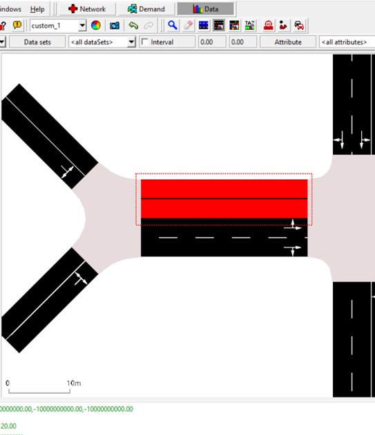
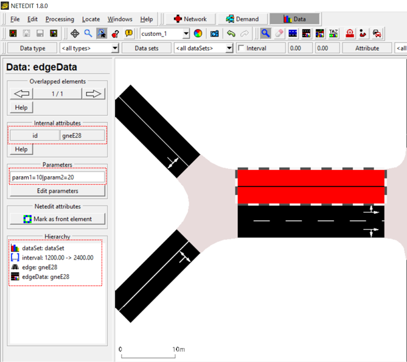

# Data specific modes

EdgeData are elements associated with one or several edges, used for multiple purposes (especially Demand). They have their own mode, selectable through the top button or by pressing F4.

Data mode overview

Edge datas are defined within a general set (DataSet), and within a certain time interval

Defining a new data set

Defining a data interval

Defining parameters 

## Edge data mode

EdgeData are created over a single edge.

Click over an edge to create a edgeData

Inspecting an edge data

## Edge rel data mode

EdgeRelDatas are created over two edges

Click over first edge

Click over second edge to create path

Press enter to create edge rel data

## TAZ relation mode

This mode helps to visualize the existing relation and the traffic demand amount between any two TAZ (Traffic Anaylsis Zone) after loading the respective xml file containing the information about start TAZ, end TAZ, interval, vehicle type and demand count. So, with this mode, users can have an better overview about the distrubtuion of traffic demand between Tazs. The way to load a input file and the available features are explained below.

### Data loading
The basic data format is as following:

```xml
<data>
    <interval id="DEFAULT_VEHTYPE" begin="0.00" end="86400.99"> \
        <tazRelation from="17" to="20" count="3965"/> \
        <tazRelation from="17" to="24" count="3100"/> \
        <tazRelation from="20" to="34" count="3192"/> \
        <tazRelation from="22" to="20" count="4575"/> \
        <tazRelation from="22" to="24" count="3576"/> \
        <tazRelation from="23" to="35" count="3267"/> \
      
    ... information about further TAZs ...
</data>
```
Other attributes can also be included in the file, such as color.

Before loading the data related to TAZ-relations the repsective network should be loaded in netedit firstly. After that, the respective TAZ file containing the polygon information about each TAZ needs to be loaded with "Load Additionals" by selecting *File-\>Additionals and Shapes* in netedit. An example of a TAZ file is shown below.

```xml
<additional>
    <taz id="1" shape="23356.47,20662.79 22463.50,20524.87 22401.18,21140.95 23162.64,21353.48 23356.47,20662.79" color="51,128,255"> \
        <param key="Id" value="59"/> \
      
    ... information about further TAZs ...
    </taz>

</additional>
```
Now, file(s) containing TAZ-Relations can be loaded with "Load Data Elements" by selecting *File-\>Data Elements*. After that, the button "Data" in the tool bar should be pressed. All TAZ-relations will then be shown.

### Display the TAZ pologons by different colors
You can click "Polygons" in the window shown after selecting *Edit-\>Edit Visualisation* and change the colors randomly or by selection. You can also directly click the color palette icon "View Settings" in the tool bar to open the respective window and make color changes.


You can also unfill the pologons by clicking the icon "Draw TAZ fill" (see the picture below).


The way to draw the relation line can be either from centroid to centroid or from border to border by clicking "Draw TAZREL drawing mode" (see the example below).


### Display the relation lines by color according to the amount of TAZ demands 
It is also possible to display the relation lines with different colors according to the respective amount of TAZ demands. The way to set it is shown below.


The demand range for each color can be further adjusted/customized as well.

### Change the width size of the TAZ relation lines
The width of the relation lines can be adjusted. It is especially useful for better visualisation when there are many edges in the given network. Firstly, You click "Data" in the window shown after selecting *Edit-\>Edit Visualisation* or after clicking the color palette icon "View Settings". After inputting the desired width size in the rubric "Exaggerate tazRelation width by" you click "openGL", press the button "Recalculate boundaries" and then press "OK" so that the adjusted relation lines can be properly shown. The buttons/rubics you need to click are illustrated below.

 


### Select TAZ relations

If only certain TAZ relations should be observed, such as with larger demand amount, it is possible to make TAZ-relation selection. The buttons/items you need to click/choose are circled in red in the picture below. Then you need to input your selection criterion in the rubric (3000 in the example below), circled in blue. After that, you can see the amount of the selected TAZ-relations, circled in yellow. So, in this example, it means that 34 TAZ-relations have a demand amount larger than 3000.


If only the TAZ-relations with a demand amount between two criteria need to be observed, you further remove the TAZ-relations with a demand amount larger than higher cirterion after you selecting the TAZ-relations with the lower criterion, as illustrated below, i.e. click the rubic "remove" (circled in green) , change the criterion to 5000 (circled in brown) and press the ENTER butten in this example, and then you can see that 19 TAZ-relations (circled in green) are selected.


To only see the selected TAZ relations you need to further press the button "Reduce" (see the illustration below). You can again adjust the width size of the TAZ-relations to get a proper view.


### Save the selected TAZ relations

The selected TAZ relations after the "Reduce" action and the respective attributes can be easily saved in XML format (see the illustration below).


