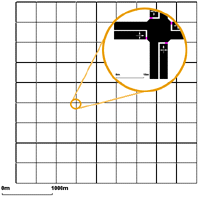
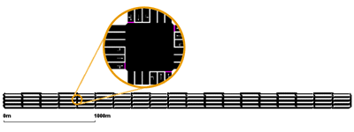

[netgenerate](../netgenerate.md) allows the generation of three
types of abstract networks: grid, spider and random.

The type of network you want to create must be stated with one of the
following switches: **--grid**, **--spider** or **--rand**. You can supply the name of the network to
generate using **--output** *<FILENAME\>* or **-o** *<FILENAME\>* for short, default "net.net.xml".

# Grid-like Networks

You are able to describe how many junctions in x- and in y-direction you
want to be build and how far from each other they should be. The
parameter for the number of junctions are **--grid.x-number** and **--grid.y-number**, while the distance
between the junctions are **--grid.x-length** and **--grid.y-length**. If you want to build networks which
have the same values for both axes, use **--grid.number** and **--grid.length**. The lengths are given in
meters. It is possible to give another option **--grid.attach-length**, which adds streets of
the given length at the boundary of the grid such that all crossings
have four streets (It is not yet possible to have different attach
lengths for x and y directions).

An example usage for building could be:

```
netgenerate --grid --grid.number=10 --grid.length=400 --output-file=MySUMOFile.net.xml
```

or:

```
netgenerate --grid --grid.x-number=20 --grid.y-number=5 \
 --grid.y-length=40 --grid.x-length=200 --output-file=MySUMOFile.net.xml
```

These calls will generate the following networks, respectively:




# Spider-like Networks

Spider networks are defined by the number of axes dividing them
(parameter **--spider.arm-number** or **--arms**, default is 13), the number of the circles they are made
of (**--spider.circle-number** or **--circles**, default is 20) and the distance between the circles (**--spider.space-radius** or **--radius** in
meters, default is 100).

!!! caution
    The number of edges within the middle of the spider net may be quite large, so it is often not possible to build a traffic light junction here. Therefore, this junction is always unregulated.

Optionally, you can omit the central junction of the network by
specifying **--spider.omit-center** or **--nocenter**. This also gives an easy way of generating a circle
network. Using for instance

```
netgenerate --spider --spider-omit-center --output-file=MySUMOFile.net.xml
```

will create a circle consisting of 13 elements with a radius of 100m.

Two examples of usage:

```
netgenerate --spider --spider.arm-number=10 --spider.circle-number=10 \
 --spider.space-radius=100 --output-file=MySUMOFile.net.xml
```

and:

```
netgenerate --spider --spider.arm-number=4 --spider.circle-number=3 \
 --spider.space-radius=100 --output-file=MySUMOFile.net.xml
```

These calls will generate the following networks, respectively:


# Random Networks

The random network generator does just what its name says, it builds
random networks. Several settings may be changed:

- **--rand.iterations** {{DT_INT}}:
- **--rand.bidi-probability** {{DT_FLOAT}}: the probability to build a reverse edge
- **--rand.max-distance** {{DT_FLOAT}}: the maximum edge length
- **--rand.min-distance** {{DT_FLOAT}}: the minimum edge length
- **--rand.min-angle** {{DT_FLOAT}}: the minimum angle between two edges
- **--rand.num-tries** {{DT_INT}}:
- **--rand.connectivity** {{DT_FLOAT}}:
- **--rand.neighbor-dist1** {{DT_FLOAT}}:
- **--rand.neighbor-dist2** {{DT_FLOAT}}:
- **--rand.neighbor-dist3** {{DT_FLOAT}}:
- **--rand.neighbor-dist4** {{DT_FLOAT}}:
- **--rand.neighbor-dist5** {{DT_FLOAT}}:
- **--rand.neighbor-dist6** {{DT_FLOAT}}:

An example:

```
netgenerate --rand -o MySUMOFile.net.xml --rand.iterations=200
```

This call will generate the following network:


## Random Grids

By setting the option **--rand.grid**, additional grid structure is enforce during random network generation. 
Newly generated grid nodes, will branch of in cardinal directions from existing nodes at multiples of **--rand.min-distance** up to a distance of **--rand.max-distance**. Since new nodes are connected to multiple existing nodes, there will still be edges at arbitrary angles but the basic structure of the network is grid-like.

{: style="height:380x;width:392px"}
{: style="height:380px;width:299px"}

# Further Options

All abstract network types share some command line options. As all
networks may possess junctions, you are able to set the default type of
junctions to build using the **--default-junction-type-option** (or **-j** for short). The following junction
types are allowed in accordance to the junction types currently known by
the simulation: priority, traffic_light.

Further, you can specify the default street type by using the same
options as in the [netconvert](../netconvert.md)-application.
