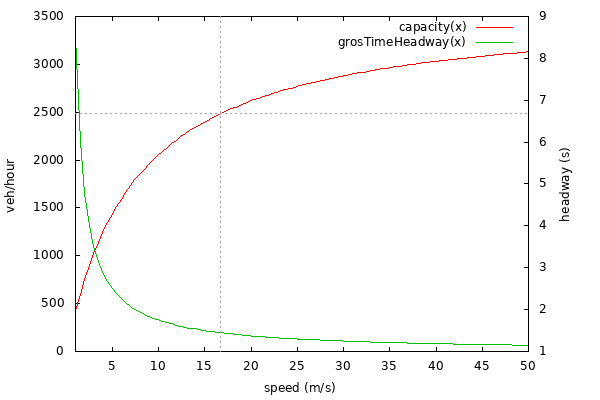

# Introduction

The capacity of a road is typically expressed as vehicles/hour and describes the
maximum traffic flow that a road can handle.

As a rule of thumb, the capacity of a multi-lane road is the product of the
capacity of a single lane multiplied by the number of lanes. The exact relation
ship is more complex and depends on the distribution of vehicle speeds and the
lane changing dynamics.

# Lane Capacity

The capacity of a single lane is inversely proportional to time headways
between successive vehicles. Assuming homogeneous traffic and equal headways:

`capacity = 3600 / grosTimeHeadway`

Where `grosTimeHeadway` denotes the time it takes for two successive vehicle
front-bumpers to pass the same location.

In constrast `netTimeHeadway` denotes the time it takes for the follower vehicles
front-bumper to reach the location of the leaders rear-bumper.

# Computing Headways

The exact time headways observered in the simulation depend on the used
carFollowModel and it's parameters. The easiest case to analyze is the one where all
vehicles drive at the same speed *s*.

Let `grosHeadway` denote the distance between successive vehicle front-bumpers
and `netHeadway` denote the distance from follower front-bumper to leader
rear-bumper.

For the default 'Krauss'-Model, the following vType attributes are relevant for
the minimum time headway (corresponding to maximum flow and hence lane
capacity):

- *length*: the phyiscal length of a vehicle in m (default 5)
- *minGap*: the minimum gap between vehicles in a standing queue in m (default 2.5)
- *tau*: the desired minimum time headway in seconds (default 1)

Assuming that all vehicles are driving at at constant speed *s*, the following
headways hold for 'Krauss':

- `netHeadway = minGap + tau * s`
- `grosHeadway = length + minGap + tau * s`

From this we can directly compute the time headways:

- `netTimeHeadway = minGap / s + tau`
- `grosTimeHeadway = (length + minGap) / s + tau`

Due to length and minGap, the capacity of a road depends on it's speed limit (whereas
the tau component is independent of speed).
At high road speeds, the tau component is the dominant factor whereas length and minGap dominate at low speeds.

The following graph shows the ideal time headways and road capacities for different
road speeds with the default model parameters for length, minGap and tau.

# Further headway effects

The above computation only holds for vehicles driving at constant speeds and
with minimum distances. This rarely occurs in a simulation for the following
reasons

- vehicles have different desired speeds ([modeled as a speedFactor distribution](Definition_of_Vehicles%2C_Vehicle_Types%2C_and_Routes.md#speed_distributions))
- vehicles have randomized slow-downs ([depending on the carFollowModel](Definition_of_Vehicles%2C_Vehicle_Types%2C_and_Routes.md#car-following_models)).
- vehicles are not always in a configuration of minimum following distances. Care must be taken especially for [vehicle insertion](Simulation/VehicleInsertion.md#effect_of_simulation_step-length)

The following table shows road capacities that can be achieved at vehicle
insertion depending on the used vType and insertion parameters.
